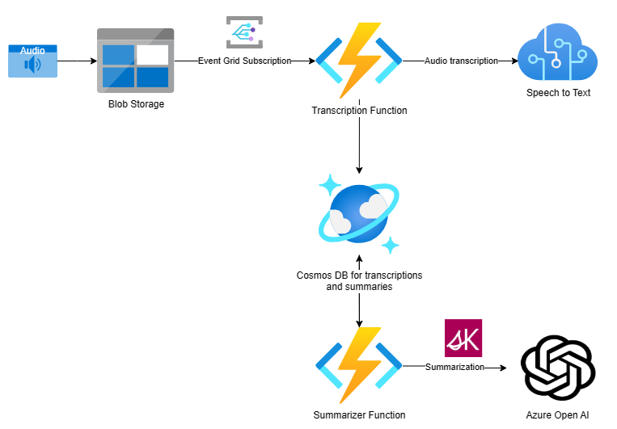

# Transcription and Summarization of Audio Files

## Introduction

This repository demonstrates how to use the [Azure AI Services](https://azure.microsoft.com/en-us/products/ai-services/ai-speech/) to transcribe audio files and summarize the results using [Azure OpenAI](https://azure.microsoft.com/es-es/products/ai-services/openai-service/).

The implementation is based on two functions:
- transcription-manager: that gets triggered when new audio files have been uploaded to a blob storage container. The function uses the Speech to text API to transcribe the audio file and stores the result in a Cosmos DB container.
- transcription-summarizer: that gets triggered when new transcriptions have been stored in the Cosmos DB container. The function uses the OpenAI API and [Semantic Kernel](https://learn.microsoft.com/en-us/semantic-kernel/overview/) to summarize the transcription and stores the result in a Cosmos DB container.

The high level architecture is shown in the following diagram:

The steps to deploy the whole solution are described in the following sections.
- [transcription-manager](./transcription-manager/README.md)
- [transcription-summarizer](./transcription-summarizer/README.md)