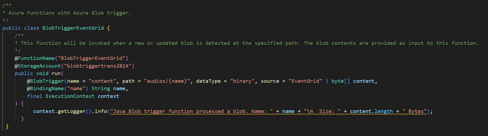
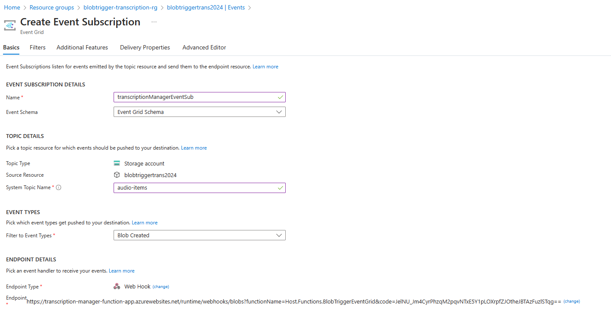
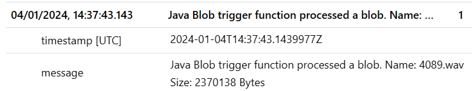

# Azure functions Speech to text

The following is a sample of how to use the Azure AI Services Speech to text API in an Azure function.

The audio file is stored in a blob storage container and the function is triggered by a blob trigger.

Once the audio file is processed, the text is stored in a Cosmos DB container.

## Setup

### Environment variables

The following environment variables are required:

```bash	
export RESOURCE_GROUP=<resource-group-name>
export STORAGE_ACCOUNT_NAME=<storage-account-name>
export CONTAINER_NAME=audios
export LOCATION=<location>
```	

### Steps

These steps also guides you through the development process of the Azure Function using Java, starting from a simple blob trigger to a more complex function that uses the Speech to text API and stores the result in Cosmos DB.

In case you want to skip the steps and deploy the final function, you can skip implemention details and simply deploy the required resources, the function app and the configuration.

0. Create Resource group

```bash
az group create --name $RESOURCE_GROUP --location $LOCATION
```

1. Create a new Azure storage account and create a new blob container.

```bash
az storage account create --name $STORAGE_ACCOUNT_NAME --resource-group $RESOURCE_GROUP --location $LOCATION --sku "Standard_LRS"  
az storage container create --name $CONTAINER_NAME --account-name $STORAGE_ACCOUNT_NAME 
```

2. Create a new Azure function app that useds a blob trigger:

Follow next sample for the implementation of the blob trigger function with certain modifications (as per image below):

https://learn.microsoft.com/en-us/azure/azure-functions/functions-event-grid-blob-trigger?tabs=isolated-process%2Cnodejs-v4&pivots=programming-language-java#create-a-blob-triggered-function



Change pom.xml to use maven properties:

```xml
<appName>${functionAppName}</appName>
<resourceGroup>${resourceGroup}</resourceGroup>
<appServicePlanName>${functionAppName}-plan</appServicePlanName>
<region>${location}</region>
```

Deploy function app:

```bash
mvn clean package azure-functions:deploy -DfunctionAppName=transcription-manager-function-app -DresourceGroup=$RESOURCE_GROUP -Dlocation=$LOCATION
```

Add WebJobs connection string to function app, since it is using a different one for the BlobTrigger:

```bash
export STORAGE_ACCOUNT_FOR_BLOB_CS=$(az storage account show-connection-string --name $STORAGE_ACCOUNT_NAME --resource-group $RESOURCE_GROUP --output tsv | cut -d ';' -f 1-4)
az functionapp config appsettings set --name transcription-manager-function-app --resource-group $RESOURCE_GROUP --settings "AzureWebJobs"$STORAGE_ACCOUNT_NAME"="$STORAGE_ACCOUNT_FOR_BLOB_CS
```

Create subscription for blob trigger:

https://learn.microsoft.com/en-us/azure/azure-functions/functions-event-grid-blob-trigger?tabs=isolated-process%2Cnodejs-v4&pivots=programming-language-java#create-the-event-subscription



https://transcription-manager-function-app.azurewebsites.net/runtime/webhooks/blobs?functionName=Host.Functions.BlobTriggerEventGrid&code=JelNU_Jm4CyrPhzqM2pqvNTxE5Y1pLOXrpfZJOtheJBTAzFuzlSTqg==


3. Upload sample file to blob storage

```bash
az storage blob upload --account-name $STORAGE_ACCOUNT_NAME --container-name $CONTAINER_NAME --file ./media/sample_audio_parte_accidente.wav
```

List contents of blob storage:

```bash
az storage blob list --account-name $STORAGE_ACCOUNT_NAME --container-name $CONTAINER_NAME --output table
```

Simple test done! We should see the following log trace in application insights:



Delete blob:

```bash
az storage blob delete --account-name $STORAGE_ACCOUNT_NAME --container-name $CONTAINER_NAME --name katiesteve_mono.wav
```

4. Create Azure AI Speech service

```bash
az cognitiveservices account create --name speech-service --resource-group $RESOURCE_GROUP --kind SpeechServices --sku S0 --location $LOCATION --yes
```

Create app settings for function app with Speech Service region and key:

```bash
export SPEECH_KEY=$(az cognitiveservices account keys list --name speech-service --resource-group $RESOURCE_GROUP --output tsv | cut -f 1)
az functionapp config appsettings set --name transcription-manager-function-app --resource-group $RESOURCE_GROUP --settings "SPEECH_KEY"="$SPEECH_KEY"
az functionapp config appsettings set --name transcription-manager-function-app --resource-group $RESOURCE_GROUP --settings "SPEECH_REGION"="$LOCATION"
az functionapp config appsettings set --name transcription-manager-function-app --resource-group $RESOURCE_GROUP --settings "SPEECH_LANGUAGE"="es-ES"
```

Add dependencies to pom.xml:

```xml
    <dependency>
        <groupId>com.microsoft.cognitiveservices.speech</groupId>
        <artifactId>client-sdk</artifactId>
        <version>1.34.0</version>
    </dependency>
```

Implement the Speech to text API call using ConversationTranscriber. See example code from:

https://github.com/Azure-Samples/cognitive-services-speech-sdk/blob/master/quickstart/java/jre/conversation-transcription/src/speechsdk/quickstart/Main.java
https://learn.microsoft.com/en-gb/azure/ai-services/speech-service/get-started-stt-diarization?tabs=linux&pivots=programming-language-java#diarization-from-file-with-conversation-transcription


5. Save transcription to Cosmos DB

Create Cosmos DB account:

```bash
az cosmosdb create --name transcription-cosmosdb --resource-group $RESOURCE_GROUP --locations regionName=$LOCATION failoverPriority=0 isZoneRedundant=False --default-consistency-level Eventual 
```

Create database and container:

```bash
az cosmosdb sql database create --account-name transcription-cosmosdb --name transcription-db --resource-group $RESOURCE_GROUP
```

Create app settings for function app with Cosmos DB connection string:

```bash
export COSMOSDB_CONNECTION_STRING=$(az cosmosdb keys list --name transcription-cosmosdb --resource-group $RESOURCE_GROUP --type connection-strings --query connectionStrings[0].connectionString --output tsv)
az functionapp config appsettings set --name transcription-manager-function-app --resource-group $RESOURCE_GROUP --settings "CosmosDBConnectionString"="$COSMOSDB_CONNECTION_STRING"
```

Add dependencies to pom.xml in order to manage the output json:

```xml
    <dependency>
        <groupId>org.json</groupId>
        <artifactId>json</artifactId>
        <version>20231013</version>
    </dependency>
```

Add CosmosDB output binding. See sample:

https://learn.microsoft.com/en-us/azure/azure-functions/functions-bindings-cosmosdb-v2-output?tabs=python-v2%2Cisolated-process%2Cnodejs-v4%2Cextensionv4&pivots=programming-language-java#http-trigger-save-one-document-to-database-via-outputbinding


